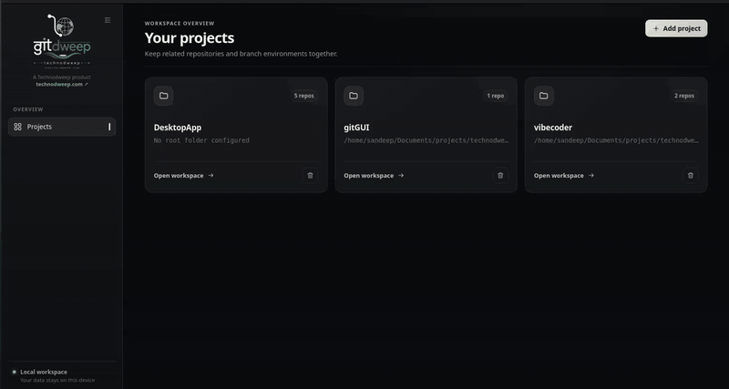
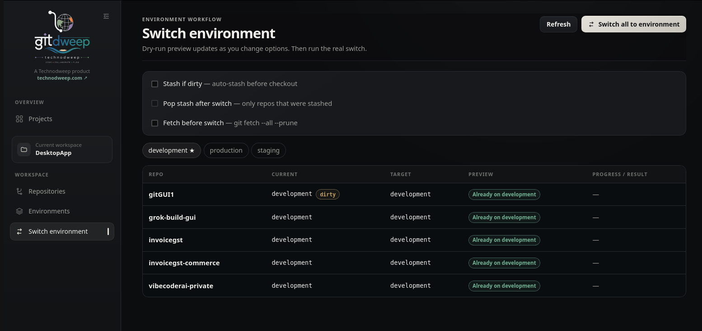

<p align="center">
  
</p>

<h1 align="center">GitDweep — Multi-Repository Git GUI</h1>

<p align="center">
  A desktop Git client for managing projects, branches, and environment workflows across multiple repositories.
</p>

<p align="center">
  
  
  
  
  <a href="https://github.com/sandeepkurien/git-gui/actions/workflows/build-linux.yml"></a>
</p>

GitDweep is a desktop Git GUI for developers who work across many repositories. Group repositories into projects, map branches to environments such as development, staging, and production, then switch an entire workspace with a dry-run preview and optional stash and fetch controls.

Built with Tauri 2, React, TypeScript, Rust, and SQLite, GitDweep keeps multi-repository Git workflows visible and repeatable without replacing the system Git installation.

## Demo

[](./docs/videos/gitdweep-multi-repository-git-workflow-demo.mp4)

**[▶ Watch the GitDweep multi-repository Git workflow demo (MP4, 2.4 MB)](./docs/videos/gitdweep-multi-repository-git-workflow-demo.mp4)**

_The GIF previews the workflow. Click it or use the link to watch the higher-quality video._

### Screenshot



_Preview branch targets and repository status before switching a complete project to another environment._

## Why GitDweep?

- **One workspace, many repositories** — organize related Git repositories as a single project.
- **Environment-aware branches** — define the target branch for every repository in development, staging, production, or a custom environment.
- **Safer bulk switching** — preview every checkout before it runs, with optional fetch, auto-stash, and stash restoration.
- **Everyday Git operations** — fetch, pull, push, stage, commit, inspect diffs, browse history, and manage branches from one desktop app.
- **Local-first storage** — project configuration stays in a local SQLite database.

## Features

- Add a project by scanning a folder or selecting repository paths manually.
- Reuse the same repository in multiple projects.
- View repositories as a list or as tabs with commits and working-tree changes.
- See branch, dirty, and ahead/behind status at a glance.
- Run `fetch --all --prune`, fast-forward-only pull, or push across enabled repositories.
- Fetch and preview pulls per repository, then fast-forward or merge clean divergence with conflicts preserved for resolution.
- Pull, push, stage, unstage, discard, commit, and inspect diffs per repository.
- Browse commit history, detach at a commit, or create a branch from a commit.
- Create and delete branches or switch a single repository to a local or remote branch.
- Build reusable environment-to-branch mappings for every repository in a project.
- Dry-run a bulk environment switch before checkout.
- Optionally stash dirty repositories, restore created stashes, and fetch before switching.

## Tech stack

- [Tauri 2](https://tauri.app/) desktop shell
- [React 19](https://react.dev/) and [TypeScript](https://www.typescriptlang.org/) user interface
- [Rust](https://www.rust-lang.org/) backend
- [SQLite](https://www.sqlite.org/) local persistence
- System Git for repository operations

## Requirements

- Node.js 20+
- Rust stable and Cargo
- Git available on `PATH`
- Linux: WebKitGTK 4.1 and the related Tauri system dependencies, including `libwebkit2gtk-4.1-dev`, `libgtk-3-dev`, `librsvg2-dev`, and `patchelf`

## Getting started

Clone the repository and install the dependencies:

```bash
git clone https://github.com/sandeepkurien/git-gui.git
cd git-gui
npm install
```

Start GitDweep in development mode:

```bash
npm run tauri:dev
```

You can also use the Tauri CLI command directly:

```bash
npm run tauri dev
```

Create a production build:

```bash
npm run tauri:build
```

Run the Rust and TypeScript checks:

```bash
npm run check
```

## Linux troubleshooting

### Blank window or GPU errors

If the window is blank and the terminal reports errors similar to the following, WebKitGTK may be having trouble with the GPU driver (often NVIDIA):

```text
Failed to create GBM buffer ... Permission denied
KMS: DRM_IOCTL_MODE_CREATE_DUMB failed
```

The app sets safe defaults automatically. You can also force them manually:

```bash
export WEBKIT_DISABLE_DMABUF_RENDERER=1
export WEBKIT_DISABLE_COMPOSITING_MODE=1
npm run tauri dev
```

If the window is still blank, try software rendering:

```bash
export LIBGL_ALWAYS_SOFTWARE=1
export GDK_BACKEND=x11
npm run tauri dev
```

### Release compatibility

Linux desktop binaries use system GTK, WebKitGTK, and GLIBC libraries. Build the release package on the oldest Ubuntu version you intend to support. A package built locally on Ubuntu 24.04 can require GLIBC 2.39 and will not start on Ubuntu 22.04.

The `Build Linux packages` GitHub Actions workflow builds `.deb` and `.AppImage` installers on Ubuntu 22.04 and checks that the executable does not require a GLIBC version newer than 2.35. Those artifacts support x86-64 Ubuntu 22.04 and newer releases. Run it from **Actions → Build Linux packages → Run workflow**, or push a tag whose name starts with `v`.

Do not distribute Linux release packages built on a newer local machine when older Ubuntu releases need to be supported.

## Local data

GitDweep stores application state in SQLite under the operating system's app-data directory. On Linux, the default location is:

```text
~/.local/share/com.technodweep.gitworkspace/git-workspace.db
```

## Application routes

| Route | Purpose |
| --- | --- |
| `/` | List and create projects |
| `/projects/:id` | View repositories, status, history, and per-repository actions |
| `/projects/:id/environments` | Create environments and edit branch mappings |
| `/projects/:id/switch` | Preview and run a bulk environment switch |

## Roadmap

- Pull request provider integrations
- Git submodule and worktree support
- Additional platform packaging and automated releases

## Contributing

Contributions, bug reports, and feature ideas are welcome. Open an issue before starting a large change so the approach can be discussed, then submit a focused pull request with the relevant checks passing.
